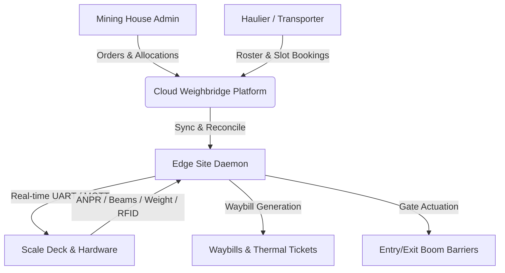

# 📊 Executive Summary & System Overview: Weighbridge & Access Control Management System

**Document Version:** 2.0  
**Prepared For:** Executive Management & Engineering Leadership  
**Project:** WeighTruck / SmartMine Cloud Weighbridge Management Platform  
**Reference Document:** `Weighbridge_RBAC_Matrix_v2.docx`

---

## 1. Executive Summary & Purpose

The **Weighbridge & Access Control Management System (WeighTruck)** is an enterprise, multi-tenant industrial logistics and scale automation platform tailored for the mining and mineral extraction industry.

The platform bridges physical site hardware (load cells, optical alignment beams, barrier boom gates, RFID badge readers, and ANPR cameras) with a cloud-native management platform, providing **tamper-evident auditability**, **zero-trust role-based access control (RBAC)**, **anti-fraud weighing enforcement**, and **contractor self-service**.



---

## 2. System Actors & Operational Personas (RBAC Overview)

The platform enforces strict multi-tenant boundary isolation and role-based operational scopes across **6 primary personas**:

| Actor / Persona | Primary Scope | Core Responsibilities |
| :--- | :--- | :--- |
| **👑 Platform Super Admin** | Platform-Wide | Global system management, onboarding mining companies and haulier tenants, managing global hardware device topologies, reviewing consolidated audit logs, and overseeing fraud analytics across all operations. |
| **🏢 Mining Company Admin** | Mining House Scope | Manages company mine sites, mineral products (e.g. RB1 Export Coal, Eskom grade), pit sources, dispatch/receipt contract orders, assigns bulk tonnage quotas to contracted hauliers, and defines custom roles. |
| **🖥️ Weighbridge Operator** | Site / Scale Deck Scope | Operates live scale consoles, monitors real-time load cell weights and optical positioning beams (P1/P2), performs zero-scale calibration triggers, manages manual vehicle check-ins, and handles reprint requests. |
| **👮 Security Officer** | Gate Barrier Scope | Controls security boom gates, conducts physical truck/driver safety inspections, validates security copy waybills, and logs vehicle tampering incidents. |
| **🚛 Transporter / Haulier** | Own Fleet Scope | Contractor self-service: registers fleet vehicles, trailers, and drivers, assigns RFID badges, books arrival delivery slots against allocated orders, views trip histories, prints waybill slips, and pulls automated CSV reports. |
| **👔 Yard Supervisor** | Shift Scope | Reviews and approves arrival slot bookings, manages scale exceptions, and formally signs off on overload violation incidents. |

---

## 3. Core Functional Capabilities Breakdown

Based on the **Weighbridge RBAC Matrix**, the system is structured into 8 functional domains:

### 3.1. Operations & Orders Management
- **Contract Orders**: Mining admins create bulk dispatch (sale) or receipt (feed) orders with agreed tonnages and validity periods.
- **Haulier Allocation**: Contracted transport companies are assigned tonnage allocations against active orders.
- **Time-Slot Scheduling**: Transporters book arrival slots with specific truck-trailer-driver combinations to prevent yard congestion.
- **Approval Workflow**: Yard supervisors review and approve incoming booking queues.

### 3.2. Real-Time Weighbridge Automation & Hardware Control
- **Optical Positioning Beams (P1/P2)**: Infrared sensors ensure trucks are fully stationary and centered on the scale platform before gross/tare weights are locked.
- **ANPR Camera Recognition**: Automated license plate reading matches physical vehicles against scheduled bookings.
- **RFID Driver Authentication**: Drivers scan contactless cards at the outdoor kiosk to verify driver identities against bookings.
- **Automated Barrier Actuation**: Traffic boom gates open automatically on successful weighment and lock automatically on overload or tare drift.
- **Edge Resilience**: The edge daemon continues operating scale lanes offline during internet outages, syncing transactions upon reconnection.

### 3.3. Multi-Copy Waybills, Tickets & Slip Printing
- **Multi-Copy PDF Generation**: Generates 3 specialized PDF waybill copies:
  1. **Client / Commercial Copy**: Full financial and consignment details.
  2. **Driver Copy**: Consignment route, product, gross, tare, and net weights.
  3. **Security Copy**: Gate verification slip with timestamp and axle compliance check.
- **Thermal Receipt Slips**: 80mm ESC/POS compatible text format for high-speed weighbridge cabin printers.
- **Reprint Tracking**: All duplicate prints are watermarked as `REPRINT` and logged to the immutable audit trail to prevent dual-load fraud.
- **Cryptographic QR Code Verification**: Every waybill contains a secure QR code hash (`/verify/[hash]`) that allows roadside authorities or security to verify slip authenticity instantly.

### 3.4. Fleet & Driver Roster Management
- **Fleet Registry**: Transporters maintain their own truck registrations, trailer configurations, and tare baseline histories.
- **Driver Roster**: Digital management of driver licenses, medical fitness expiries, safety induction consents, and linked RFID cards.
- **Blacklisting**: Mining admins or hauliers can instantly revoke site access for non-compliant drivers or vehicles.

### 3.5. Anti-Fraud, Anomaly Detection & Incident Management
- **Overload Prevention**: Automatically blocks vehicles exceeding South African legal axle limits (e.g. 56,000 kg gross combinations), sounding audible alarms and requiring supervisor resolution.
- **Tare Weight Drift**: Flags discrepancies where empty truck tare weights deviate significantly from registered baselines.
- **Driver / Vehicle Mismatch Detection**: Flags security alerts if an unauthorized driver badge is presented for a booked vehicle.

### 3.6. Immutable Audit Trail & Consolidated Analytics
- **Tamper-Evident Ledger**: Every critical action (order creation, weighment, override, gate actuation, ticket reprint) is cryptographically signed and logged.
- **Exportable Reporting**: Self-service CSV and PDF reports for Fleet Rosters, Orders, Transactions, Turnaround Times, and Security Incidents.

---

## 4. Key Upgrades & Changes Delivered Since Last Week

Over the past development sprint, significant architectural enhancements, enterprise features, and testing workflows were completed:

```
┌──────────────────────────────────────────────────────────────────────────────────┐
│                           KEY ENHANCEMENTS SUMMARY                               │
├──────────────────────────┬───────────────────────────────────────────────────────┤
│ Domain                   │ Upgrades Implemented                                  │
├──────────────────────────┼───────────────────────────────────────────────────────┤
│ 1. Multi-Tenant Security │ • Enforced strict tenant isolation between mining     │
│                          │   houses (Seriti, Glencore, Exxaro, etc.) and hauliers│
│                          │ • Added granular custom role permission assignments.  │
├──────────────────────────┼───────────────────────────────────────────────────────┤
│ 2. Hardware Simulation   │ • Created automated virtual scale UART emulator,      │
│    & Automation          │   optical beam logic (P1/P2), and RFID card readers.  │
│                          │ • Validated end-to-end normal and overload scenarios. │
├──────────────────────────┼───────────────────────────────────────────────────────┤
│ 3. Slips & Reporting     │ • Added multi-format slip generation (PDF & Thermal)  │
│                          │ • Added 4 automated CSV exports for Transporters.     │
│                          │ • Implemented audited reprint watermarking.           │
├──────────────────────────┼───────────────────────────────────────────────────────┤
│ 4. Fleet & Order Flow    │ • Enabled independent fleet registration & bookings.  │
│                          │ • Added alternative truck/trailer assignment workflows│
├──────────────────────────┼───────────────────────────────────────────────────────┤
│ 5. Cloud Infrastructure  │ • Migrated database to Supabase PostgreSQL with       │
│                          │   Prisma ORM and connection pooler optimization.      │
│                          │ • Deployed Next.js 15 production app to Vercel.       │
│                          │ • Repository cleaned and pushed to GitHub (Bafana4949)│
│                          │ • 14/14 automated unit & integration tests passing.   │
└──────────────────────────┴───────────────────────────────────────────────────────┘
```

### Detailed Deliverables:

1. **Enterprise Multi-Tenant RBAC Architecture**:
   - Expanded user management to support independent mining houses (Seriti, Glencore, Exxaro, Anglo Inyosi, Sibanye-Stillwater, Harmony Gold) and independent transporter hauliers (SG Coal, Reinhardt Transport, Comotrans, Chrome Carriers).
   - Mining admins and transporters only see data belonging to their respective organizations, while Super Admins maintain platform-wide governance.

2. **Complete Hardware Simulator & Scenario Automation**:
   - Built a virtual hardware testing harness simulating ANPR plate captures, RFID driver badge taps, optical alignment beam interruptions, and UART load cell streams.
   - Successfully executed automated scenarios demonstrating both **normal weighment releases** (55,220 kg) and **overload alarm lockouts** (61,500 kg).

3. **Multi-Format Slip Printing & Waybill Reprint Governance**:
   - Built full PDF waybill rendering (`Client Copy`, `Driver Copy`, `Security Copy`) and 80mm thermal receipt slips.
   - Implemented audited reprint counters so that any duplicate printing is visibly marked and permanently recorded in the audit log.

4. **Transporter Portal & Self-Service Reports**:
   - Hauliers now have complete autonomy to upload trucks, trailers, and drivers, assign RFID cards, book delivery slots, and export 4 distinct CSV reports (Fleet Roster, Order Allocations, Trip History, and Transaction Logs).

5. **Cloud Deployment & Production Verification**:
   - Pushed clean, production-ready codebase to GitHub (`https://github.com/Bafana4949/WeighTruck-app`).
   - Deployed database migrations and demo seed sets to Supabase PostgreSQL.
   - Deployed the Next.js 15 web application to Vercel with responsive dashboards across desktop, tablet, and operator consoles.
